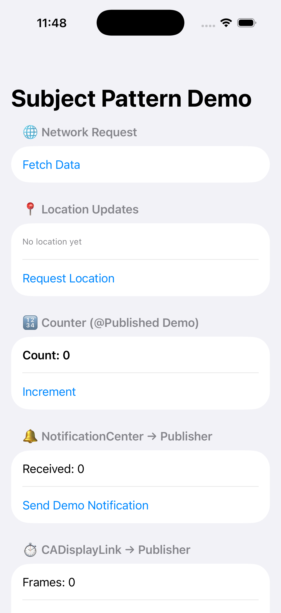

# SubjectPatternDemo

A small iOS SwiftUI app showing how to use the **Subject → Publisher pattern** in [Combine](https://developer.apple.com/documentation/combine):

- **Networking**: Bridge `URLSession` callbacks into Combine using `PassthroughSubject`.
- **Location**: Bridge `CLLocationManagerDelegate` into Combine using `PassthroughSubject`.
- **State (@MyPublished)**: Show how `@Published` uses `CurrentValueSubject` under the hood.
- **NotificationCenter**: Bridge notifications to a publisher via `PassthroughSubject`.
- **CADisplayLink**: Bridge frame ticks to a publisher via `PassthroughSubject`.
- **Reachability (NWPathMonitor)**: Bridge network path updates to a publisher.
- **UIControl (UITextField)**: Bridge target–action `editingChanged` to a publisher.

## Screenshots

## Run

- Open `SubjectPatternDemoApp.xcodeproj` in Xcode 16+.
- Select the `SubjectPatternDemoApp` scheme and a simulator/device, then press Cmd+R.
- When prompted, allow Location for the demo.

Notes: Networking uses `https://jsonplaceholder.typicode.com/todos/1`. DisplayLink runs on the main runloop. Reachability uses `NWPathMonitor`.

## Why This Matters

This pattern is used everywhere in modern Swift frameworks:

- Convert delegate-style APIs to Combine publishers
- Drive SwiftUI UIs with reactive state
- Decouple imperative event sources from reactive subscribers

## Architecture

- SwiftUI + MVVM
- Combine for reactivity
- No third-party dependencies

---

💡 Author: *Banghua Zhao*  
⭐️ Please star if you find this useful!
